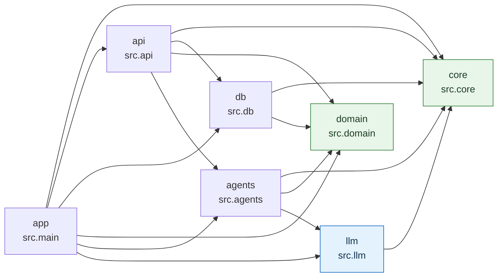
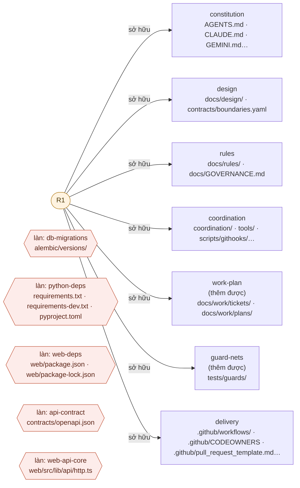

# ARCHITECTURE — Agentfold

> Vùng bảo vệ `design`. Mô tả hệ thống ĐANG chạy — luồng mới mà không có ở đây là tính năng ẩn
> (`docs/rules/00-core.md` R00.4). Đổi kiến trúc: ADR trước, cập nhật file này trong cùng PR.

## 1. Nguyên tắc

1. **Mô hình ngôn ngữ chọn, code tính.** Mô hình chỉ trả schema hẹp (mã, số lượng); lõi tất định tính mọi
   con số người dùng thấy, từ dữ liệu có nguồn.
2. **Fail closed.** Không xác định được thì từ chối, không đoán: mã lạ, thiếu nguồn, hành động chưa khai báo,
   cấu hình production thiếu.
3. **Con người là cổng cuối** cho hành động rủi ro cao và cho thiết kế.
4. **Mọi ràng buộc quan trọng là code hoặc test,** không phải câu chữ trong prompt hay tài liệu.
5. **Thiết kế cho nhiều người và nhiều agent làm song song:** không file đăng ký tập trung, không trạng thái
   ghi tay dùng chung, tài nguyên tuần tự đi qua làn độc quyền.

## 2. Bối cảnh hệ thống

<!-- HAND-DRAWN:context — người vẽ; sơ đồ này mã hoá quyết định, không suy ra được -->

```
 Người dùng ──► web/ (Next.js, Vercel) ──HTTP /api/v1──► src/ (FastAPI, Render, Docker)
                                                          │
                                   ┌──────────────────────┼───────────────────────┐
                                   ▼                      ▼                       ▼
                        PostgreSQL (Supabase/        src/llm ──► nhà cung cấp     audit_log
                        Postgres tự quản)            (cửa ngõ duy nhất)           (ai·gì·trước/sau)
```

<!-- /HAND-DRAWN:context -->

> Sơ đồ này **không** sinh tự động: nó nói dự án chọn phục vụ ai và nói chuyện với hệ thống ngoài nào —
> một quyết định phạm vi, không suy được từ code. Lưới canh chỉ kiểm nó **có mặt**, không kiểm nó đúng.

## 3. Lớp và ranh giới (nguồn sự thật: `contracts/boundaries.yaml`)

<!-- GENERATED:layers — sinh bởi scripts/generate_diagrams.py, không sửa tay -->
| Lớp | Gói | Được import | Trách nhiệm |
|---|---|---|---|
| `app` | `src.main` | mọi lớp | lắp ráp, cổng production, CORS, router |
| `core` | `src.core` | — (không import lớp nào) | cấu hình cấp ứng dụng, cổng production |
| `domain` | `src.domain` | — (không import lớp nào) | tính toán tất định, có nguồn |
| `db` | `src.db` | `core`, `domain` | engine, session, model (tự khám phá) |
| `llm` | `src.llm` | `core` | cửa ngõ mô hình: giao diện, adapter, an toàn prompt |
| `agents` | `src.agents` | `core`, `domain`, `llm` | điều phối mô hình + lõi; sổ hành động rủi ro |
| `api` | `src.api` | `core`, `db`, `domain`, `agents` | route (tự khám phá), xác thực, lỗi |



Nền xanh lá (`core`, `domain`): lõi tất định — không import lớp nào, và cấm cả SDK mạng/ORM/LLM.
Nền xanh dương (`llm`): cửa ngõ DUY NHẤT được import SDK nhà cung cấp LLM.
Mũi tên `A → B` = A **được phép** import B. Chiều nào không có mũi tên là chiều bị lưới canh chặn.
<!-- /GENERATED:layers -->

Lưới canh: `tests/guards/test_import_boundaries.py`. Gói cấp cao mới phải khai trong hợp đồng — đó là
quyết định kiến trúc. Bảng và sơ đồ ngay trên **sinh ra từ hợp đồng**: sửa `contracts/boundaries.yaml`
(kể cả `description`) rồi chạy `python scripts/generate_diagrams.py`; sửa tay ở đây sẽ bị CI bắt lệch.

## 4. Luồng mẫu "chọn — tính — duyệt"

<!-- HAND-DRAWN:flow — người vẽ; sơ đồ này mã hoá quyết định, không suy ra được -->

```
yêu cầu (văn bản tự do, KHÔNG tin cậy)
  └─► agents/quote_agent.draft_quote
        ├─ llm/safety: scan_for_injection (ghi log) · fence + sanitize (làm phẳng xuống dòng)
        ├─ llm/safety: assert_no_egress (chặn bí mật/PII — fail closed)
        ├─ llm/gateway.select(prompt, LLMSelection)   ← chỉ {item_id, quantity}, extra="forbid"
        └─ domain/catalog/pricing.compute_quote       ← đơn giá từ danh mục có nguồn; mã lạ ⇒ từ chối
  └─► bản nháp (MEDIUM, ghi audit_log)
  └─► người có vai trò duyệt ─► publish (HIGH, agents/actions.require_approval)
```

<!-- /HAND-DRAWN:flow -->

Kể cả khi injection thành công tuyệt đối, kẻ tấn công chỉ đổi được *chọn gì*, không đổi được *bao nhiêu*,
và không đi vòng được cổng duyệt.

## 5. Dữ liệu

- **Alembic là nguồn sự thật duy nhất của schema.** Model mới = module mới trong `src/db/models/` + migration
  trong làn `db-migrations`. Không `create_all()` ở production.
- Bảng nền: `audit_log` (actor, action, target, before/after, trace_id).
- Dev/test dùng SQLite; migration được kiểm thêm trên PostgreSQL thật ở CI vì SQLite chấp nhận những schema
  PostgreSQL từ chối.
- CSDL của máy phát triển **không bao giờ** là CSDL production. Script ghi dữ liệu mặc định chạy thử (dry-run).

## 6. Hợp đồng API

- Tiền tố `/api/v1`. Bản chụp `contracts/openapi.json` sinh từ ứng dụng và commit (làn `api-contract`); lưới
  canh đỏ khi lệch.
- Lỗi: `{code, detail, retryable}`. Lỗi hạ tầng có thể thử lại → 503 + `Retry-After`, không lộ chi tiết driver.
- Phân quyền hai lần: vai trò ở route, chủ sở hữu ở truy vấn; bản ghi của người khác → 404.

## 7. Cấu hình và bí mật

- `pydantic-settings`, mỗi miền một lớp với tiền tố riêng; bí mật là `SecretStr`.
- `APP_ENV=production` bật cổng khởi động: khoá JWT mặc định/ngắn, SQLite, CORS mặc định hoặc regex quá rộng
  ⇒ dịch vụ không lên, báo mọi lỗi một lần.
- `.env` không bao giờ vào git; `.env.example` cập nhật cùng PR thêm biến.

## 8. Triển khai

- Backend: Docker (không chạy bằng root, có healthcheck) trên Render, `autoDeployTrigger: checksPass`.
- Frontend: Vercel, Deployment Checks chờ đúng tên job CI; bản dựng thiếu `NEXT_PUBLIC_API_BASE_URL` thì đổ.
- CI: các job không `needs` nhau (để mọi check tồn tại ngay từ đầu), PR nháp không chạy CI, mọi job chạy trên
  lần đẩy vào `main`. Chi tiết và lý do: `docs/DEPLOY.md`, `docs/rules/50-workflow.md`.

## 9. Mặt phẳng điều phối phát triển (không chạy trong sản phẩm)

```
AGENTS.md ◄── adapter (CLAUDE.md · GEMINI.md · copilot-instructions · .cursor · .aider)
    │
docs/design/ (người chốt) ──► docs/work/tickets/<ID>.md (phạm vi đã duyệt, trên main)
                                        │
          tools/agentctl start ──► sổ claim nguyên tử (nhánh agent-claims) ──► worktree riêng
                                        │
          hook ghi file ─► pre-commit ─► CI scope-guard (công cụ chạy từ commit gốc) ─► người review ─► merge
```

Quyết định và lý do: `docs/design/adr/0001-multi-agent-control-plane.md`. Luật: `docs/rules/70-multi-agent-coordination.md`.

### Ai sở hữu vùng nào

<!-- GENERATED:ownership — sinh bởi scripts/generate_diagrams.py, không sửa tay -->


Vùng bảo vệ: sửa được khi (a) PR có nhãn duyệt, (b) ticket đã duyệt khai id vùng trong `scope.protected`, hoặc (c) vùng cho `allow_additions` và thay đổi là THÊM file mới.
Làn độc quyền (viền đỏ): **một ticket giữ tại một thời điểm** — không gắn chủ, gắn thứ tự.
<!-- /GENERATED:ownership -->

Sơ đồ trên sinh từ `coordination/policy.yaml`; chủ vùng trong file đó lại sinh từ
`docs/design/team-profile.yaml`. Đổi người/quy mô đội thì chạy `generate_team_docs.py` **trước**, rồi
mới `generate_diagrams.py` — ngược thứ tự sẽ vẽ ra chủ cũ.

## 10. Hệ thống KHÔNG làm

Dự án điền từ `docs/design/PRD.md` §4.2 — nói rõ trong tài liệu và giao diện, không để người dùng tự suy.
