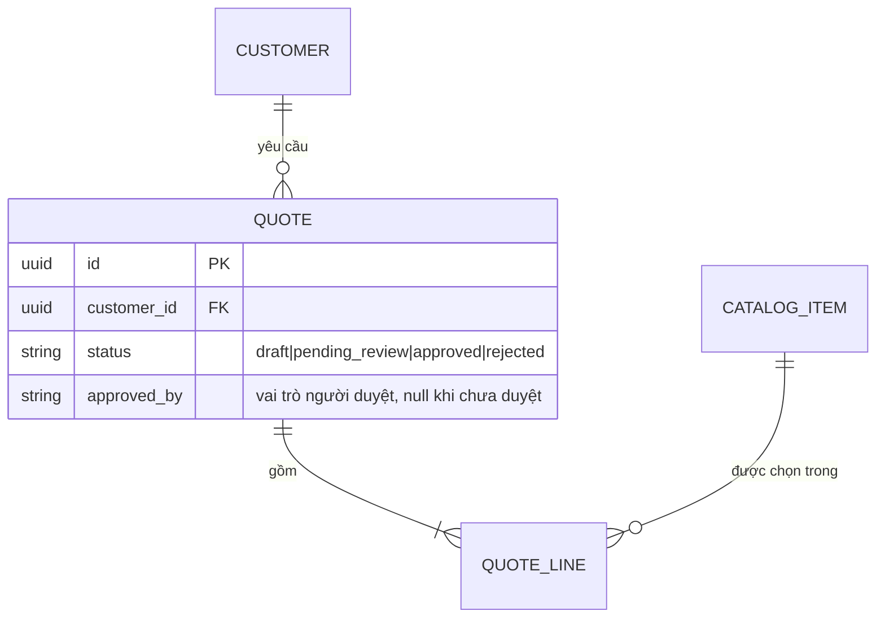

# Mô hình dữ liệu: ERD + từ điển dữ liệu, rồi mới tới code

Thứ tự: **nghiệp vụ → thực thể → ERD → từ điển dữ liệu → duyệt → model + migration** (skill `db-migration` của pack
`backend`). Đi ngược (viết model rồi suy ra tài liệu) thì tài liệu chỉ mô tả lại code, không ai kiểm được code có đúng
ý nghiệp vụ không.

## 1. Thực thể từ nghiệp vụ

Từ luồng nghiệp vụ và bảng yêu cầu (skill `design-tables`): gạch chân danh từ có định danh riêng và vòng đời riêng →
ứng viên thực thể. Với mỗi thực thể ghi: định nghĩa một câu, ai tạo, ai đọc, ai sửa, có vòng đời không (nếu có → máy
trạng thái).

## 2. ERD (Mermaid)

Lưu ở `docs/design/ARCHITECTURE.md` §5 Dữ liệu (hoặc `docs/design/diagrams/erd.md` khi lớn). Nhãn quan hệ là động từ.

## 3. Từ điển dữ liệu (bảng bắt buộc)

| Bảng.cột | Kiểu | Null | Ràng buộc / miền | Ý nghĩa | Nguồn (R40.2) | Nhạy cảm | Chủ |
|---|---|---|---|---|---|---|---|
| `quote.status` | `varchar(20)` | không | CHECK ∈ {draft, pending_review, approved, rejected} | trạng thái duyệt | hệ thống | thấp | R1 |
| `quote_line.unit_price` | `numeric(12,2)` | không | ≥ 0 | đơn giá tại thời điểm báo giá | `catalog_item` + `source_ref` | thấp | R2 |
| `customer.phone` | `varchar(20)` | có | định dạng E.164 | liên hệ | người dùng nhập | **cao (PII)** | R2 |

- **Nguồn**: con số nghiệp vụ có `source`/`source_ref` thật, không "LLM sinh".
- **Nhạy cảm**: thấp / nội bộ / cao (PII, sức khoẻ, tài chính). Cột "cao" quyết định khử định danh, phân quyền, log (R40.8).
- **Chủ**: vai trò chịu trách nhiệm ý nghĩa cột (`docs/GOVERNANCE.md`).

## 4. Quyết định thiết kế cần ghi

- Khoá: UUID hay số tăng; khoá tự nhiên dùng để upsert (skill `data-ingest`).
- Chuẩn hoá tới đâu; chỗ nào cố ý lưu bản sao (vd. giá tại thời điểm báo giá) và vì sao.
- Xoá mềm hay xoá cứng; lịch sử thay đổi (bảng audit, bảng phiên bản).
- Tiền: `numeric`, không `float`. Thời gian: có múi giờ (`timestamptz`), lưu UTC.
- Enum: CHECK/bảng tra thay vì chuỗi tự do.

Quyết định đáng kể → DEC; đổi mô hình đã chốt → ADR.

## 5. Đối chiếu ngược

Sau khi có model + migration: mọi cột trong code có trong từ điển và ngược lại; `python scripts/check_migration_matches_models.py`
xanh (job CI `migration-postgres`). Lệch → sửa bên sai, không sửa tài liệu cho khớp code sai.
